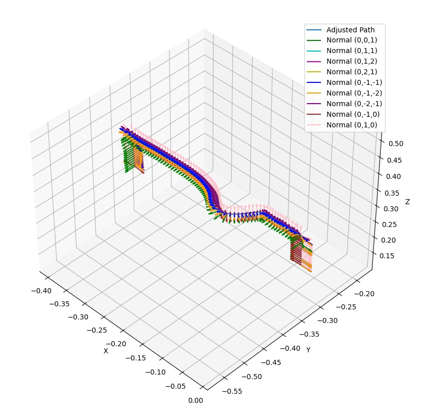
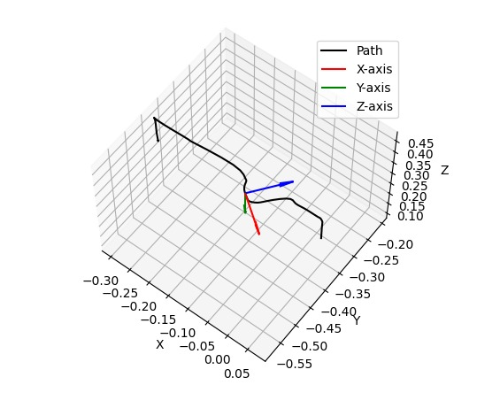

# Bead Maze Final Project - "A Bead Maze is not a kids' game"

Task-space trajectory planning for a UR5e robotic arm to accurately follow a predefined 3D bead maze path while minimizing the Fréchet distance between task-space and configuration-space trajectories.

## Project Overview

**Challenge:** Plan and execute a UR5e robotic arm trajectory such that its end-effector accurately follows a complex 3D bead maze path, translating a physical task-space trajectory into coordinated configuration-space movements.

**Team:** Nir Manor (305229627), Ortal Cohen (308524875)

**Date:** 06/2024

---

## Problem Description

### The Bead Maze Challenge

**Task:** Translate a physical 3D trajectory (the bead maze path) into robot joint movements that allow the end-effector to precisely follow the path.

**Key Distinction:**
- **Task Space:** The physical environment where the robot operates - the 3D bead maze path
- **Configuration Space:** The robot's joint angle space - the mathematical representation of possible robot positions

**Mission Objective:**
Design a configuration-space trajectory that minimizes the deviation from the desired task-space trajectory (the bead maze path) by finding a path through configuration space that keeps the robot's end-effector as close as possible to the actual maze path.

**Core Challenges:**
- **3D Path Modeling:** Creating an accurate representation of the 3D bead maze path
- **Inverse Kinematics:** Converting task-space waypoints to valid joint configurations
- **End-Effector Orientation:** Ensuring proper orientation (tangent, normal, and binormal constraints)
- **Collision-Free Motion:** Avoiding self-collisions and obstacles
- **Path Continuity:** Achieving smooth transitions between configurations
- **Multiple IK Solutions:** Selecting the best configuration among multiple possible solutions

---

## Distance Metrics for Path Fidelity

### Hausdorff Distance
- **Definition:** Maximum distance from any point on one path to the closest point on the other path
- **Use Case:** Measures overall deviation between paths
- **Limitation:** Doesn't consider sequence of points along the path

### Fréchet Distance
- **Definition:** The minimum "leash length" needed for two entities to traverse two paths while remaining connected
- **Intuition:** Like a person walking a dog where the person follows one path and the dog follows another
- **Advantage:** Considers the sequence and ordering of points, providing better path similarity measure
- **Mathematical Principle:** Finds the optimal reparameterization of both paths to minimize the maximum distance
- **Application:** Ideal for measuring how well a robot follows a predefined trajectory

**Our Approach:** We minimize the Fréchet Distance between the desired task-space path and the actual path taken by the robot's end-effector in configuration space.

---

## Solution Methodology

### Step 1: 3D Path Modeling

**Challenge:** Create an accurate digital representation of the physical bead maze prototype

**Approach Used:**
- Built a physical 3D bead maze prototype (straight line + curve)
- Manually sampled robot configurations along the path using UR5 interface
- Converted sampled configurations to task-space coordinates using forward kinematics
- Processed and cleaned the collected configuration data

**Path Representation:**
- 3D path modeled as waypoints in task space
- Each waypoint contains position (x, y, z) information
- Path divided into smaller segments for optimization

### Step 2: Inverse Kinematics and Configuration Computation

**For Each Waypoint:**

1. **Tangent Vector Computation:**
   - Calculate the direction of the path at each point
   - Used to determine end-effector orientation constraints

2. **Normal and Binormal Vectors:**
   - Generate multiple candidate normal vectors perpendicular to the tangent
   - Binormal vectors computed as cross-product of tangent and normal
   - Different normal orientations provide collision avoidance flexibility

*Visualization of different normal vector options along the 3D path, showing the various orientations considered for the end-effector*

*2D representation showing tangent vectors and selected normal orientations for end-effector alignment*

3. **Valid Configuration Generation:**
   - Compute inverse kinematics for each waypoint with different normal options
   - **Validation Criteria:**
     - Configuration within joint angle limits (-π, π)
     - No self-collisions between robot links
     - No collisions with the prototype path (treated as obstacle)
     - No collisions with floor or environment
     - End-effector within 1 cm of the desired path point
   - **Orientation Requirements:**
     - Z-axis points perpendicular to path tangent
     - Negative Y and negative Z directions to minimize floor collisions
     - Test different roll angles around tangent vector for additional valid configurations

### Step 3: Bottleneck Shortest Path through Configuration Graph

**Graph Construction:**
- **Vertices:** All valid IK configurations grouped by waypoint (layer)
- **Edges:** Connections between:
  - Configurations within the same waypoint (same layer)
  - Configurations between consecutive waypoints (adjacent layers)
  - Only edges without collisions are added
- **Edge Cost:** Measures deviation from desired path

**Path Computation:**
- Implement a Dijkstra-like **bottleneck shortest path** algorithm
- For each vertex, cost = maximum edge weight along path to that vertex
- This minimizes the maximum deviation from the desired path
- **Result:** Path that minimizes Fréchet distance (minimal "leash length")

---

## Simulation Results

### 3D Path Following - Python Simulation

The path planning algorithm was validated through simulation before real-world implementation. The following shows the optimal trajectory found through the bottleneck shortest path algorithm:

*Python simulation showing the UR5e robot arm smoothly following the 3D bead maze path. This demonstrates the solution found by minimizing the Fréchet distance between the desired task-space trajectory and the robot's configuration-space motion.*

**Simulation Observations:**
- Robot maintains smooth, continuous motion along the path
- End-effector stays close to the maze trajectory
- Configurations transition smoothly between waypoints
- No sudden jumps or jerky movements (except at the very end)

**Challenges Discovered During Simulation:**
- Robot's last link occasionally rotates 360 degrees unexpectedly
- Occurs when 6th joint value transitions from 0.*** to 360.***
- Small configuration change results in nearly full rotation instead of minor adjustment
- This wasn't fully captured in the animation but observed in real testing

---

## Results and Findings

### Mission Achievement

**Success:** The robot successfully follows the 3D bead maze path, maintaining appropriate distance from the trajectory for most of the movement.

**Path Fidelity:**
- End-effector generally maintains proper distance from path
- If a bead were present on the maze, the robot would push it along the path for most of the trajectory
- Occasional deviations occur (too close or too far from path)
- These deviations may be due to inaccuracies in the path model itself

### Key Observations

1. **Smooth Motion:**
   - Robot moves smoothly without significant jerks or unnecessary movements along the path
   - Demonstrates effective trajectory planning using Fréchet distance minimization

2. **Path Modeling Issues:**
   - The physical path model created by manual sampling may have inaccuracies
   - These errors propagate through the IK computation and path planning
   - Further refinement needed in path modeling methodology

3. **Joint 6 Rotation Problem:**
   - Unexpected 360-degree rotation of the last link observed during lab tests
   - Cause: Configuration discontinuity where 6th joint jumps from 0.*** to 360.***
   - Impact: Robot nearly completes full rotation instead of small adjustment
   - Mitigation strategies attempted but not fully resolved

### Recommendations for Improvement

1. **Better Path Modeling:**
   - Use computer vision systems to accurately capture the 3D path
   - Alternative: Design path with sufficient waypoint density to avoid discontinuities

2. **Joint Angle Wrapping:**
   - Implement angle wrapping logic to handle 360-degree discontinuities
   - Pre-process configurations to maintain continuity

3. **Validation Tools:**
   - Use live simulator synchronized with real robot
   - Would have detected rotation issue before physical deployment

4. **Path Planning Enhancement:**
   - Consider using splitting strategy to divide path into smaller segments
   - Optimize each segment individually to reduce local minima

---

## Project Files

- `Bead_Maze_Report.pdf` - Complete project report including:
  - Detailed problem description
  - Methodology and approaches (3D path modeling, IK computation, bottleneck shortest path)
  - Mathematical formulations
  - Experimental results and observations
  - Challenges and solutions
  - Lessons learned and future work

- Python Code Files:
  - `path_model.py` - Path modeling and spline fitting
  - `path_model_Bezier_curves.py` - Bezier curve representation alternative
  - `building_blocks.py` - Core motion planning components
  - `kinematics.py` - UR5e kinematics and forward/inverse kinematics
  - `visualizer.py` - Simulation visualization
  - `run.py` - Main execution script

- Configuration Files:
  - `2D_curve_waypoint.json` - 2D path waypoints
  - `3D_curve_waypoint.json` - 3D path waypoints

---

## Key Technical Concepts

### Fréchet Distance Minimization
Instead of traditional path planning, this project focuses on **matching** the robot's motion to a predefined trajectory by minimizing Fréchet distance - the optimal way for two entities to traverse different paths while remaining connected.

### Bottleneck Shortest Path Algorithm
A Dijkstra-like algorithm that finds the path minimizing the **maximum deviation** from the desired trajectory, equivalent to minimizing Fréchet distance.

### Multi-Normal Orientation Strategy
Instead of a single end-effector orientation, the algorithm generates multiple valid orientations (different normal vectors) for each waypoint, providing:
- Flexibility in collision avoidance
- Multiple valid configurations to choose from
- Better handling of constrained environments

---

## Lessons Learned

1. **Path Accuracy is Critical:**
   - Small errors in path modeling compound through IK computation
   - Real-world measurements should use computer vision or precision sensors

2. **Configuration Space Discontinuities:**
   - Joint angles can jump across boundaries (0° to 360°)
   - Must handle angle wrapping to avoid unnecessary large rotations

3. **Simulation vs. Reality Gap:**
   - Simulation doesn't always capture all physical behaviors
   - Live simulator integration would improve debugging

4. **Algorithm Effectiveness:**
   - Fréchet distance is effective for trajectory following
   - Bottleneck shortest path successfully minimizes deviation

---

## Status and Future Work

**Current Status:** ✅ Complete implementation with simulation and real-world testing

**Future Improvements:**
- Implement angle wrapping for joint 6 discontinuity
- Improve path modeling using vision systems
- Add live simulator integration
- Consider adaptive path splitting for complex trajectories
- Implement learning-based approaches for parameter optimization

---

**Project Team:** Nir Manor (305229627), Ortal Cohen (308524875)
**Date:** 06/2024
**Topics:** Task-Space Planning, Fréchet Distance, Bottleneck Shortest Path, Configuration Space Optimization
