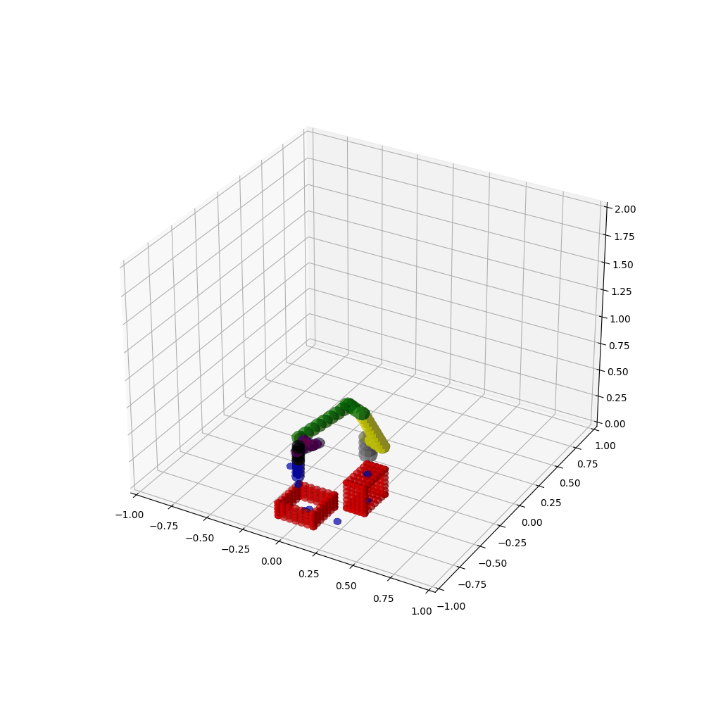
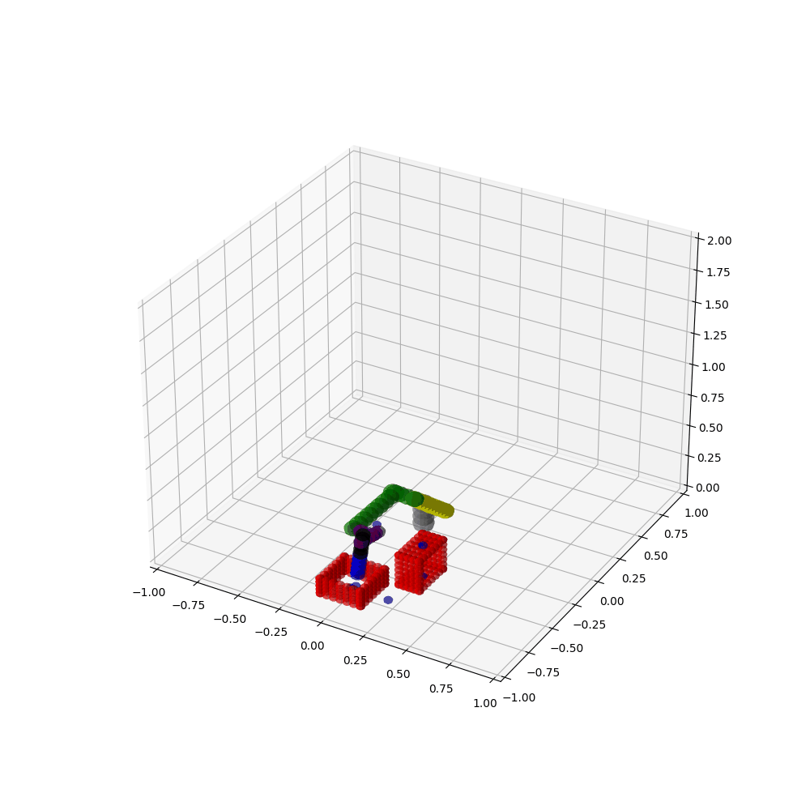

# Complex Motion Planning Tasks - Cube Rearrangement for Letter Formation

Advanced motion planning for robotic manipulation: arranging six cubes to form the initials "N" and "O" using a UR5e robotic arm.

## Problem Description

**Objective:** Utilize a UR5e collaborative robotic arm to physically rearrange six cubes within a simulated environment to form the letters "N" and "O" - representing the initials of the team members (Nir Manor and Ortal Cohen).

**Mission Overview:**
- **Task:** Rearrange 6 randomly-distributed cubes into specific positions
- **Goal Configurations:**
  - Letter "N": 4 cubes arranged with 1 additional pre-placed cube
  - Letter "O": 6 cubes arranged in a circular/rectangular pattern
- **Robot:** UR5e Collaborative Manipulator (6-DOF)
- **Environment:** Simulated workspace with obstacles and spatial constraints

**Key Challenges:**
- **Multi-target Manipulation:** Pick and place 6 objects sequentially
- **Dynamic Environment:** Cube positions change after each placement
- **Collision Avoidance:** Navigate around obstacles while holding objects
- **Precision Placement:** Accurate positioning of cubes at target locations
- **Grasp Planning:** Determine optimal approach angles for cube manipulation
- **Path Continuity:** Ensure smooth transitions between pickup and placement

---

## Solution Approach

### Motion Planning Strategy

**Trajectory Planning with RRT***

The solution employs an advanced motion planning approach using RRT* (Rapidly-Exploring Random Trees with rewiring optimization):

**Key Enhancements:**

1. **Adaptive Pathfinding:**
   - RRT* search resets if no path found within iteration limit
   - Prevents prolonged computation on infeasible paths
   - Ensures efficient navigation through complex workspaces

2. **Dynamic Environment Handling:**
   - Algorithm continuously updates with cube displacement information
   - Maintains path validity as environment changes
   - Recomputes paths when new cube placements affect workspace

3. **Sequential Manipulation Sequence:**
   ```
   Home Position
   → Home to Cube 1
   → Cube 1 to Destination 1
   → Return to Home
   → Home to Cube 2
   → Cube 2 to Destination 2
   ... (repeat for all 6 cubes)
   → Final Return to Home
   ```

**Collision-Aware Planning:**
- Robot continuously checks for collisions during path execution
- Accounts for held cube's size when planning around obstacles
- Generates collision-free paths in 6D configuration space

---

## Implementation and Results

### Python Simulation Results

**Letter "N" Formation - Python Simulation:**



*Python-based RRT* planning simulation: The robot arm manipulates the first cube from its initial position to the target location for the letter "N". This simulation demonstrates the path planning algorithm working in a virtual environment.*

**Letter "O" Formation - Python Simulation:**



*Python-based RRT* planning simulation: The robot arm moves a cube to its designated position in the "O" formation. The simulation validates collision-free paths and optimal trajectories before real-world implementation.*

### Real Experiment Implementation

**Physical Hardware Demonstration:**

The UR5e robotic arm was deployed in a real laboratory environment to physically execute the cube rearrangement task. This real-world implementation validated the effectiveness of the motion planning algorithms developed in Python simulation.


*Physical robot performing cube rearrangement: The UR5e collaborative robot arm manipulates wooden cubes on a laboratory table, demonstrating the successful transfer of simulation-based planning algorithms to real hardware execution.*

**Key Real-World Validation Points:**
- Successful transfer from simulation to physical hardware
- Actual robot-cube interactions and grasp dynamics
- Real-world collision avoidance and obstacle navigation
- Physical constraints and workspace limitations
- Practical deployment in laboratory environment

---

## Task Types

### Multi-Target Planning

**Problem:** Visit multiple waypoints in sequence

**Example Sequence:**
```
1. Reach picking location
2. Grasp object
3. Move to intermediate checkpoint (avoid obstacles)
4. Place object at destination
5. Return to home position
```

**Planning Approach:**
- Sequential subgoal planning
- Global path optimization
- Waypoint ordering (if not fixed)

**Complexity:** Exponential with number of targets

### Constrained Motion Planning

**Orientation Constraints:**
```
End-effector must maintain specific orientation
while avoiding obstacles

Example: Keep tool horizontal while reaching around obstacle
```

**Workspace Constraints:**
```
Keep end-effector within designated region
Useful for human-robot collaboration zones

Example: Keep arm away from operator workspace
```

**Joint Constraints:**
```
Avoid singular configurations
Respect mechanical joint limits
Maintain safe velocities

Example: Elbow-up vs elbow-down configurations
```

### Task-Aware Planning

**Manipulation Tasks:**
- Optimize for end-effector path, not joint-space path
- Maintain contact with objects during motion
- Plan around hand-held items

**Inspection Tasks:**
- Cover designated regions or surfaces
- Maintain sensor line-of-sight
- Efficiency-based path ordering

**Assembly Tasks:**
- Component insertion constraints
- Relative motion requirements
- Precision and safety requirements

---

## Advanced Planning Techniques

### Adaptive Sampling

**Standard Sampling:**
```python
x_random = uniform_random_configuration()
```

**Goal-Biased Sampling (Standard):**
```python
if random() < goal_bias:
    x_random = goal_config
else:
    x_random = uniform_random_configuration()
```

**Task-Aware Sampling:**
```python
if random() < primary_goal_bias:
    x_random = primary_goal
elif random() < secondary_goal_bias:
    x_random = current_subgoal
elif random() < exploration_bias:
    x_random = previous_successful_region()
else:
    x_random = uniform_random_configuration()
```

**Benefits:**
- Focuses search toward task-relevant regions
- Maintains exploration capability
- Can be tuned per task type

### Configuration-Space Analysis

**Identify Critical Regions:**
```
1. Narrow passages (bottlenecks)
2. High-curvature regions
3. Singular configurations
4. Self-collision boundaries
```

**Adaptive Resolution:**
```
High-collision-likelihood regions → finer resolution
Safe regions → coarser resolution
```

### Cost Functions for Multi-Objectives

**Path Length (Primary):**
```
cost = sum of edge lengths
minimize configuration-space distance
```

**Smoothness Penalty:**
```
high_curvature_penalty = sum of (angle_changes)^2
makes path smoother but longer
```

**Energy Cost:**
```
joint_effort = sum of joint velocities / time
minimize power consumption
```

**Combined Objective:**
```
total_cost = w1*length + w2*smoothness + w3*energy
weights chosen per application
```

---

## Implementation Strategies

### Hierarchical Planning

**Level 1: Global Planning (rough):**
```
Plan in reduced configuration space
Coarse collision checking
Fast initial path
```

**Level 2: Local Refinement (detailed):**
```
Refine path using detailed kinematics
Fine-grained collision detection
Smooth trajectory generation
```

**Benefit:** Combines speed of global planning with accuracy of local planning

### Constraint-Based Refinement

**Step 1: Find feasible path**
```
RRT* finds initial collision-free path
Ignores constraints
```

**Step 2: Apply constraints**
```
Post-process path to satisfy constraints
Adjust via local optimization
```

**Step 3: Validate and optimize**
```
Verify constraint satisfaction
Minimize cost subject to constraints
```

### Waypoint Sequencing

**Problem:** Optimal order for visiting targets

**Heuristic Solutions:**
1. **Nearest-Neighbor:** Greedy, fast, suboptimal
2. **Simulated Annealing:** Better quality, slower
3. **Genetic Algorithms:** Population-based, good for large problems

**For Motion Planning:**
```python
# Plan from current position to first target
path1 = plan(start, target1)

# Plan to each subsequent target
for i in range(1, num_targets):
    path = plan(last_position, target[i])
    total_path += path
```

---

## Complex Scenarios

### Scenario 1: Pick-and-Place

**Sequence:**
1. **Approach:** Plan to picking location
2. **Grasp:** Coordinate gripper closure
3. **Retract:** Lift object avoiding obstacles
4. **Transport:** Navigate to placement area
5. **Place:** Lower and position object
6. **Release:** Open gripper

**Planning Challenges:**
- Avoid moving obstacles while holding object
- Maintain grasp stability during motion
- Precise placement accuracy

### Scenario 2: Assembly

**Sequence:**
1. **Reach Part:** Plan to part location
2. **Align:** Orient for insertion
3. **Insert:** Careful motion along insertion axis
4. **Verify:** Check proper seating
5. **Extract:** Retract from assembly

**Planning Challenges:**
- Tight clearances require precise paths
- Insertion axis constraints
- Force feedback during motion (beyond kinematic planning)

### Scenario 3: Inspection Route

**Sequence:**
1. **Coverage Planning:** Identify necessary inspection points
2. **Viewpoint Planning:** Compute required end-effector positions
3. **Path Planning:** Connect viewpoints
4. **Optimization:** Minimize path length

**Planning Challenges:**
- Viewpoint selection for all surfaces
- Reachability constraints
- Efficiency of coverage

---

## Performance Metrics for Complex Tasks

### Success Metrics

**Solution Feasibility:**
```
Percentage of runs finding valid solution
Higher = better
Target: >95% for well-defined problems
```

**Constraint Satisfaction:**
```
Percentage of path satisfying all constraints
100% = all constraints met
<100% = some constraint violations
```

### Quality Metrics

**Path Efficiency:**
```
Efficiency = optimal_cost / computed_cost
1.0 = optimal
<1.0 = suboptimal
Typical: 1.1-1.5 for RRT*
```

**Task Completion Time:**
```
Total time to complete all subtasks
Includes motion time + task actions
```

### Computational Metrics

**Planning Time:**
```
Wall-clock seconds to compute solution
Must be <30s for practical applications
```

**Memory Usage:**
```
RAM required for tree and data structures
Scales with number of iterations
```

---

## Implementation Details

### Task-Specific Planner

```python
class TaskPlanner:
    def plan_multi_target(self, targets, callbacks=None):
        """
        Plan motion through multiple targets

        Args:
            targets: List of goal configurations
            callbacks: Task-specific callbacks (grasp, place, etc)

        Returns:
            Complete path through all targets
        """

    def plan_constrained(self, goal, constraints):
        """
        Plan motion under constraints

        Args:
            goal: Target configuration
            constraints: List of constraint functions

        Returns:
            Path satisfying all constraints
        """

    def plan_task_aware(self, task_description):
        """
        Plan using task-specific knowledge

        Args:
            task_description: Task with parameters

        Returns:
            Optimized path for task
        """
```

### Enhanced Building Blocks

**Constraint Checking:**
```python
def check_constraints(config, constraints):
    for constraint in constraints:
        if not constraint(config):
            return False
    return True
```

**Cost Computation:**
```python
def compute_task_cost(path, task_params):
    length_cost = compute_length(path)
    smoothness_cost = compute_smoothness(path)
    energy_cost = compute_energy(path)

    weights = task_params['cost_weights']
    total = (weights['length'] * length_cost +
             weights['smoothness'] * smoothness_cost +
             weights['energy'] * energy_cost)
    return total
```

---

## Experimental Results and Findings

### Mission Success

**Achievement:**
The implementation successfully demonstrated the UR5e robot's ability to rearrange six cubes according to desired destinations, forming the letters "N" and "O" within the simulated environment.

**Performance Characteristics:**

1. **Multi-Target Manipulation (6 Cubes):**
   - Sequential pick-and-place operations executed successfully
   - Adaptive RRT* algorithm efficiently handled path resets
   - Dynamic environment handling adjusted to cube displacement

2. **Collision Avoidance:**
   - Robot maintained obstacle clearance during manipulation
   - Paths computed in 6D configuration space
   - Collision detection active throughout manipulation sequences

### Challenges and Lessons Learned

**1. Grasp-Induced Collisions:**
- The robot arm approached collision with obstacles when grasping cubes
- Root cause: cube positioning after end-effector contact increased effective size
- **Solution:** Represent workspace cubes with safety inflation (slightly larger radii)
- **Enhancement:** Enlarge grasped cube representation to reduce collision likelihood

**2. Placement Accuracy:**
- Cubes dropped from 10 cm height did not land at exact target positions
- Reason: Physics simulation of cube drop not considered in path planning
- **Lesson:** Real-world manipulation requires accounting for object dynamics and settling effects

3. **Path Planning Efficiency:**
- Adaptive pathfinding proved effective for multi-object scenarios
- RRT* successfully navigated changing workspace configurations
- Reset mechanism prevented computational stalling on infeasible subproblems

### Future Improvements

1. **Enhanced Collision Modeling:**
   - Increase collision sphere inflation for grasped objects
   - Model object dynamics during drop phase
   - Implement grasp stability analysis

2. **Precision Enhancement:**
   - Account for physics during cube placement
   - Add settling time before re-planning next movement
   - Implement feedback correction after placement

3. **Algorithm Optimization:**
   - Adaptive goal-biasing based on task progress
   - Predictive path planning for multi-cube sequences
   - Learning-based cost function tuning from experience

---

## Files

- `assignment.pdf` - Problem specification
- `kinematics.py` - UR5e parameters
- `planners.py` - Task-specific planners
- `building_blocks.py` - Advanced components
- `environment.py` - Complex scenarios
- `visualizer.py` - Result visualization
- `RRTTree.py` - Tree data structure
- `task3_run.py` - Task execution script

---

## Usage

```bash
cd Complex-Motion-Planning-Tasks
python task3_run.py
```

Runs complex planning scenarios:
1. Multi-target navigation
2. Constrained motion
3. Task-aware planning
4. Comparative analysis

---

## Key Learnings

### Real-World Challenges
- Constraints significantly impact planning difficulty
- Multiple objectives require careful balancing
- Task-specific knowledge improves results

### Algorithm Adaptation
- Standard algorithms work but need tuning
- Task-aware variants provide significant improvements
- Constraint satisfaction adds complexity

### Practical Deployment
- Planning time must be acceptable for real-time control
- Robustness essential for production systems
- Validation and testing critical before deployment

---

**Status:** ✅ Complete with complex task planning
**Last Updated:** 2025
**Topics:** Multi-Objective Planning, Constraint Satisfaction, Task Coordination
